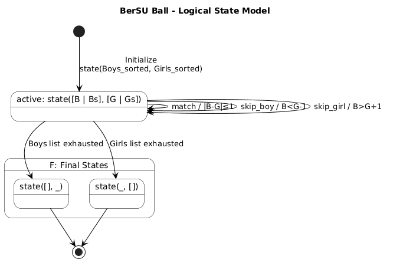

# Evidence 4 - Demonstration of a Programming Paradigm
### Lucca Traslosheros Abascal

## Context & Description

For this evidence, I have chosen to work with a Codeforces problem using the Logical Paradigm and the Prolog Language. As a competitive programmer actively training for the ICPC, Codeforces is my primary platform for algorithm practice. Converting standard algorithmic solutions into purely logical paradigms is an excellent exercise in abstracting away mutable state.

### Logical Paradigm

The logical paradigm is a declarative computational approach built on formal logic. Instead of executing a sequence of imperative commands, the program consists of facts and rules. The execution is driven by a unification engine that attempts to prove queries through pattern matching and automatic backtracking.

I will be working on the problem **'489B. BerSU Ball'**, which states the following:

> The Berland State University is hosting a ball. There are n boys and m girls, each with a given dancing skill level. A boy and a girl can form a dancing pair if the absolute difference between their skill levels is at most 1. Each person can only dance with at most one partner. Find the maximum possible number of pairs.

Because Codeforces does not natively support Prolog, I will demonstrate the functionality of my code using local test cases based on the sample inputs and a few additional original test cases.

# Logic



In a standard imperative language, assuming both arrays are sorted, this is solved using a two-pointer greedy approach with mutable indices. "In computer science, a greedy algorithm is an algorithm that finds a solution to problems in the shortest time possible. It picks the path that seems optimal at the moment without regard for the overall optimization of the solution that would be formed " (NB, 2023).  In Prolog, we implement the same algorithm differently: instead of manipulating indices, we declare the valid states of the system and the logical rules governing transitions between them. Prolog's inference engine then handles the traversal, firing exactly one rule at each step to reach a final state.

#### 1. State Representation

A state is defined by the remaining unmatched individuals, represented as `state(BoysList, GirlsList)`.

- **Initial state:** The engine starts with both sorted lists.
- **Final states:** The automaton halts when either list becomes empty, as no further pairs can be formed.

```prolog
is_final_state(state([], _)).
is_final_state(state(_, [])).
```

#### 2. Transition Rules

The core of the greedy algorithm is expressed in three mutually exclusive transition rules. Given the heads B and G of the current lists, exactly one rule applies.

- **Rule 1 (Match):** The absolute difference is at most 1, forming a valid pair. Both heads are consumed and the pair count increments.

```prolog
transition(state([B | Bs], [G | Gs]), match, state(Bs, Gs)) :-
    abs(B - G) =< 1.
```

- **Rule 2 (Skip Boy):** The boy's skill is lower than the girl's by more than 1. Because the lists are sorted, he cannot match with her or any subsequent girl, so he is discarded.

```prolog
transition(state([B | Bs], [G | Gs]), skip_boy, state(Bs, [G | Gs])) :-
    B < G - 1.
```

- **Rule 3 (Skip Girl):** The same logic but for skipping a girl.

```prolog
transition(state([B | Bs], [G | Gs]), skip_girl, state([B | Bs], Gs)) :-
    B > G + 1.
```

#### 3. Efficiency

The three transition guards are mutually exclusive by construction: for any pair of heads B and G, exactly one of `|B - G| ≤ 1`, `B < G - 1`, or `B > G + 1` holds. This means the system is fully deterministic — there is no ambiguity, no branching, and no backtracking. Each transition strictly reduces at least one list, guaranteeing termination.

This demonstrates the power of the logical paradigm: by declaring the rules that govern valid states, we obtain the same optimal greedy strategy as the imperative two-pointer approach, without ever explicitly managing indices or loop counters.

Each transition runs in $O(1)$, and the traversal visits each element at most once, giving a linear pass of $O(N + M)$. Sorting both lists beforehand costs $O(N \log N + M \log M)$, which dominates and gives an overall time complexity of: $O(N \log N + M \log M)$


# Tests

Because the solution is executed locally using SWI-Prolog, we interact using queries. The entry point is a predicate called `solve(Boys, Girls, MaxPairs)` which starts with the initial sort before passing to the state machine. 

Below are the test cases and outputs used to verify the logic which are inside the `paradigm.pl` file. It can be ran by typing this command while in the root folder of the project. 
```
swipl -g run_all_tests -t halt -s paradigm.pl
```


**Test Data Breakdown:** These are the expected results for each test case and what it's testing

* **Test 1 (Standard case)**
  * Boys Array: `[1, 2, 4, 6]`
  * Girls Array: `[1, 5, 5, 7, 9]`
  * Expected Pairs: `3`
* **Test 2 (No possible matches)**
  * Boys Array: `[1, 1, 1, 1]`
  * Girls Array: `[10, 14, 37, 47]`
  * Expected Pairs: `0`
* **Test 3 (Unsorted inputs)**
  * Boys Array: `[3, 1, 2]`
  * Girls Array: `[3, 2, 1]`
  * Expected Pairs: `3`
* **Test 4 (Empty lists)**
  * Boys Array: `[]`
  * Girls Array: `[]`
  * Expected Pairs: `0`
* **Test 5 (One empty list)**
  * Boys Array: `[1, 2, 3]`l
  * Girls Array: `[]`
  * Expected Pairs: `0`
* **Test 6 (Exact matches)**
  * Boys Array: `[1, 2, 3]`
  * Girls Array: `[1, 2, 3]`
  * Expected Pairs: `3`
* **Test 7 (Identical/offset by 1)**
  * Boys Array: `[1, 1, 1]`
  * Girls Array: `[2, 2, 2]`
  * Expected Pairs: `3`
* **Test 8 (Large gaps)**
  * Boys Array: `[10, 20, 30]`
  * Girls Array: `[5, 15, 31]`
  * Expected Pairs: `1`

**Execution & Console Output:**
Running `run_all_tests.` within swipl will yield the same result as the previous command but requires entering into the interactive interpreter. 

```text
?- run_all_tests.
Test 1 (Standard case) -> Expected: 3, Result: 3
Test 2 (No possible matches) -> Expected: 0, Result: 0
Test 3 (Unsorted inputs) -> Expected: 3, Result: 3
Test 4 (Empty lists) -> Expected: 0, Result: 0
Test 5 (One empty list) -> Expected: 0, Result: 0
Test 6 (Exact matches) -> Expected: 3, Result: 3
Test 7 (Multiple identical/offset by 1) -> Expected: 3, Result: 3
Test 8 (Large gaps, match at end) -> Expected: 1, Result: 1
true.
```
# Functional Paradigm Implementation (Racket)

To fully evaluate the strengths and characteristics of the Logical Paradigm, it is highly useful to contrast it with the Functional Paradigm. For this comparison, I implemented the exact same greedy algorithm using Racket (a dialect of Lisp).

The Functional Paradigm similarly eliminates mutable data and changing state by omitting while loops and index pointers. However, instead of having something like Prolog's inference engine to traverse states, it relies on recursion and explicit conditional evaluation (GeeksforGeeks, 2021). In Racket, the logic is handled using a `cond` statement that recursively processes the lists. We define a single function `max-pairs` that returns the evaluated sum of the pairs,

```scheme
(define (max-pairs boys girls)
  (cond
    ;; Base Case: If either list is empty, 0 pairs can be formed.
    [(or (null? boys) (null? girls)) 0]
    
    ;; Case 1 (Match): Valid pair found. Add 1 and recurse on both tails.
    [(<= (abs (- (car boys) (car girls))) 1)
     (+ 1 (max-pairs (cdr boys) (cdr girls)))]
    
    ;; Case 2 (Skip Boy): Boy's skill is too low. Recurse with the rest of the boys.
    [(< (car boys) (- (car girls) 1))
     (max-pairs (cdr boys) girls)]
    
    ;; Case 3 (Skip Girl): Girl's skill is too low. Recurse with the rest of the girls.
    [else
     (max-pairs boys (cdr girls))]))
```

Below are the test results from running `racket func.rkt` on the same inputs as the Prolog implementation. 

```code
Test 1 (Standard case) -> Expected: 3, Result: 3
Test 2 (No possible matches) -> Expected: 0, Result: 0
Test 3 (Unsorted inputs) -> Expected: 3, Result: 3
Test 4 (Empty lists) -> Expected: 0, Result: 0
Test 5 (One empty list) -> Expected: 0, Result: 0
Test 6 (Exact matches) -> Expected: 3, Result: 3
Test 7 (Multiple identical/offset by 1) -> Expected: 3, Result: 3
Test 8 (Large gaps, match at end) -> Expected: 1, Result: 1
```

# Paradigm Comparison: Logical vs. Functional

While both paradigms work to eliminate the need for indexes and mutable state. They implement this solution in different ways.
- In Prolog, the code declares the truth of what's a valid transition between states. The language itself handles the traversal engine. In Racket, the code defines a mathematical function that breaks the list down using `car` (head) and `cdr` (tail) until it arrives at a base case, then sums the results as the stack bubbles up. 
- Prolog uses the automatic pattern matching against the transition rules until one succeeds. Meanwhile, Racket uses the explicit `cond` branches to enforce the top-to-bottom evaluation.

# Benchmark & Complexity
Both implementations share identical Time and Space complexities for traversal:

- **Time Complexity**: $O(N \log N + M \log M)$ which is set by the initial sorting on both arrays. The recursive traversal for both is linear, operating in $O(N + M)$ time. 

- **Space Complexity**: $O(N + M)$ due to the call stack depth during both languages' recursion. 


# References

Codeforces. (n.d.). Problem 489B - BerSU Ball. [https://codeforces.com/problemset/problem/489/B](https://codeforces.com/problemset/problem/489/B)

GeeksforGeeks. (2021, March 9). Difference between functional and logical programming. GeeksforGeeks. https://www.geeksforgeeks.org/theory-of-computation/difference-between-functional-and-logical-programming/

NB, Tantoluwa Heritage Alabi (2023, May 12). What is a Greedy Algorithm? Examples of Greedy Algorithms. freeCodeCamp.org. https://www.freecodecamp.org/news/greedy-algorithms/